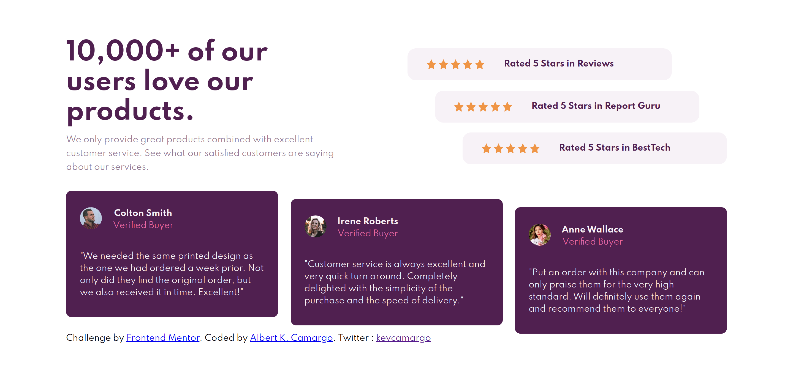
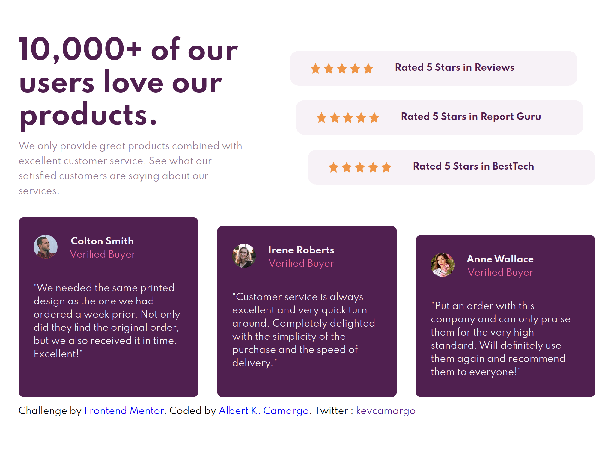
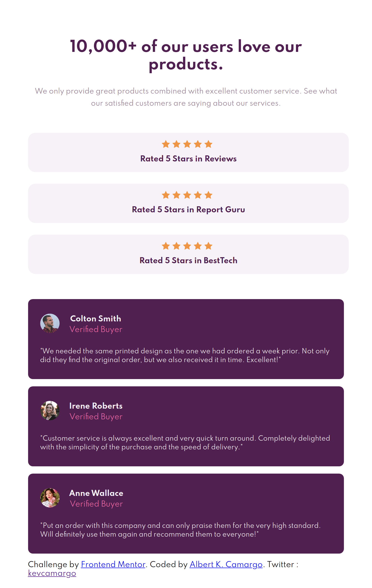
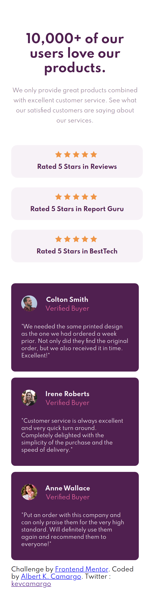

# Frontend Mentor - Social proof section

## Diseño original 

## Diseño con dimensiones 1440px * 580px

## Diseño con dimensiones 1024px * 580px

## Diseño con dimensiones 768px * 580px

## Diseño con dimensiones 375px * 580px

## Welcome my Friends! 👋

Puedes verlo en vivo y en directo [aquí](https://kevocam.github.io/frontendmentor-social-proof-section/)

Este reto lo hice con SASS, puedes modificarlo a tu manera.  🤙🤙

SALUDOS

[Frontend Mentor](https://www.frontendmentor.io) challenges allow you to improve your skills in a real-life workflow.
